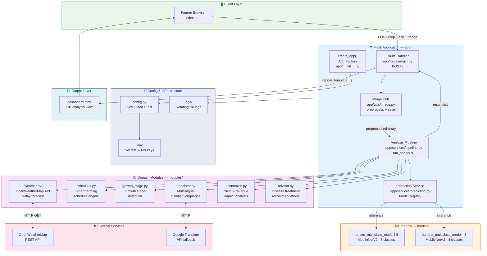
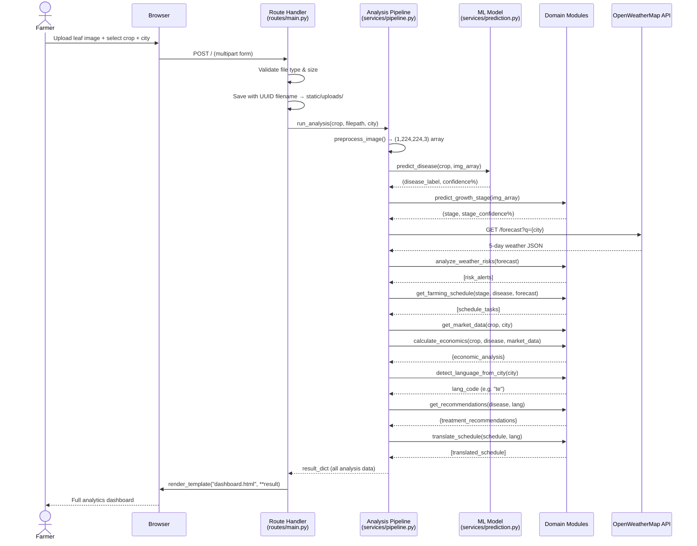
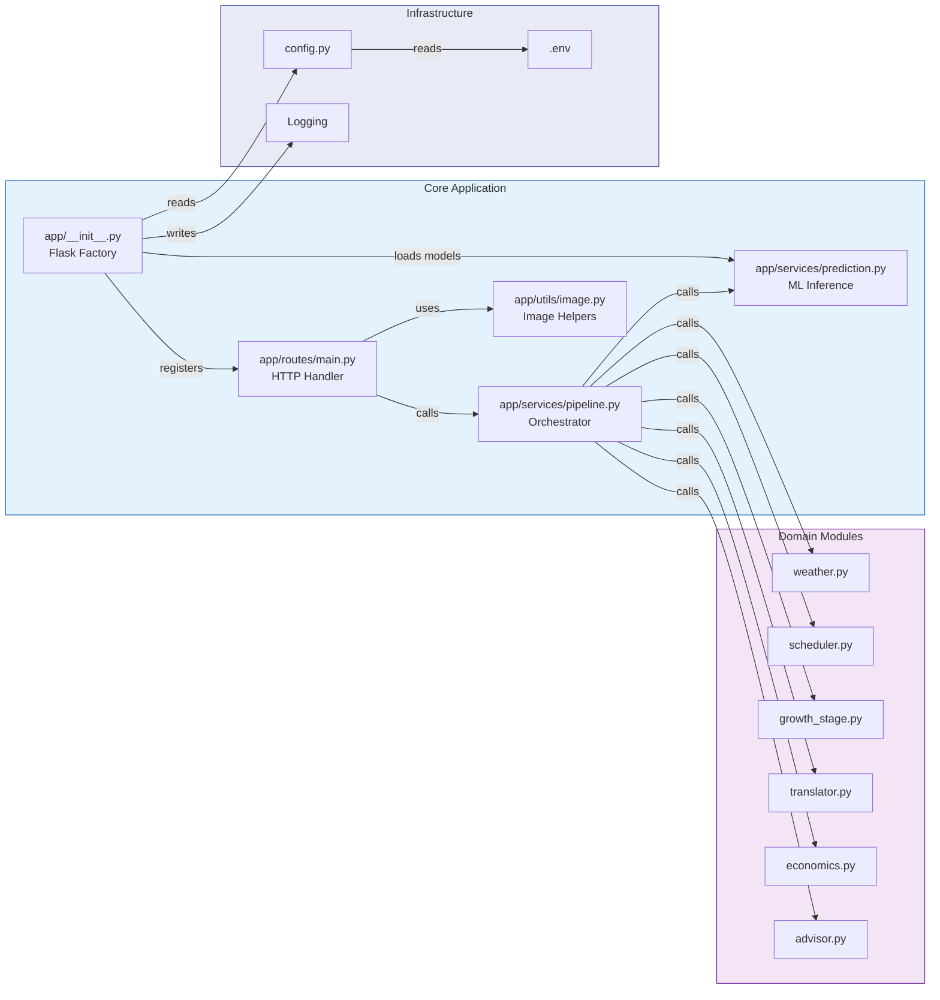

<div align="center">

# 🌿 Intelligent Crop Disease Identification System

### AI-Powered Plant Health Analysis · Weather Intelligence · Multilingual Advisory

[](https://python.org)
[](https://flask.palletsprojects.com)
[](https://tensorflow.org)
[](https://keras.io/api/applications/mobilenet/)
[](LICENSE)
[](tests/)

> **A production-ready Flask application that combines Deep Learning disease detection with real-time weather forecasting to deliver intelligent, multilingual farming recommendations for Indian farmers.**

</div>

---

## 📋 Table of Contents

- [Overview](#-overview)
- [System Architecture](#-system-architecture)
- [Request Flow](#-request-flow)
- [Module Architecture](#-module-architecture)
- [Features](#-features)
- [Supported Crops & Diseases](#-supported-crops--diseases)
- [Technology Stack](#-technology-stack)
- [Project Structure](#-project-structure)
- [Quick Start](#-quick-start)
- [Configuration](#-configuration)
- [Running Tests](#-running-tests)
- [Training Models](#-training-models)
- [API Reference](#-api-reference)
- [Dataset Citation](#-dataset-citation)

---

## 🌾 Overview

Farmers across India face critical challenges: **late disease detection**, **weather uncertainty**, and **limited access to expert agricultural advice**. This system addresses all three with a single AI-powered web application.

### Real-World Impact

| Challenge | Our Solution |
|-----------|-------------|
| 🔴 Late disease detection | AI identifies issues before they're visible to the naked eye |
| 🔴 Weather-related crop loss | 5-day forecast with farming risk alerts |
| 🔴 Suboptimal resource use | Smart scheduling reduces water & fertilizer waste |
| 🔴 Language barriers | Auto-detects regional language from city name |
| 🔴 Financial uncertainty | Quantifies yield & revenue loss in ₹ |

---

## 🏗️ System Architecture



---

## 🔄 Request Flow



---

## 📦 Module Architecture



---

## ✨ Features

### 🌱 Crop Health Analysis
- **Disease Detection** — Classifies 8 tomato conditions and 4 banana diseases using MobileNetV2 transfer learning
- **Growth Stage Tracking** — Identifies Seedling → Vegetative → Flowering → Fruiting → Maturity stages
- **Confidence Scoring** — Every prediction includes a reliability percentage

### ☁️ Weather Intelligence
- **5-Day Forecast** — Real-time data from OpenWeatherMap API
- **Agricultural Risk Analysis** — Automatic alerts for high winds, rain events, and heat stress
- **Location-Based** — Customisable for any city worldwide; auto-falls back to mock data if API unavailable

### 📅 Smart Farming Schedule
- Context-aware task recommendations driven by:
  - Detected disease status
  - Current growth stage
  - Upcoming weather conditions
- Weather-adaptive: delays chemical applications on rainy days automatically

### 💰 Economic Impact Intelligence
- Yield loss estimation (tons/acre) per detected disease
- Revenue impact in ₹ based on real-time market prices
- Location-adjusted price intelligence
- Actionable financial advice (critical / minor / none)

### 🌐 Multilingual Advisory (9 Indian Languages)
| Language | Code | Region |
|----------|------|--------|
| English | `en` | Default |
| Telugu | `te` | Telangana, Andhra Pradesh |
| Hindi | `hi` | North India, Rajasthan |
| Tamil | `ta` | Tamil Nadu |
| Kannada | `kn` | Karnataka |
| Marathi | `mr` | Maharashtra |
| Bengali | `bn` | West Bengal |
| Gujarati | `gu` | Gujarat |
| Punjabi | `pa` | Punjab |
| Malayalam | `ml` | Kerala |

> Language is **auto-detected from the city name** — no manual selection required.

---

## 🌾 Supported Crops & Diseases

### 🍅 Tomato — 8 Classes

| # | Disease | Type | Economic Loss |
|---|---------|------|--------------|
| 1 | Early_blight | Fungal | 15% |
| 2 | Late_blight | Fungal | 30% |
| 3 | Leaf_Miner | Pest | 10% |
| 4 | Spotted_Wilt_Virus | Viral | 50% |
| 5 | Magnesium_Deficiency | Nutritional | 12% |
| 6 | Nitrogen_Deficiency | Nutritional | 20% |
| 7 | Potassium_Deficiency | Nutritional | 15% |
| 8 | Healthy | — | 0% |

### 🍌 Banana — 4 Classes

| # | Disease | Type | Economic Loss |
|---|---------|------|--------------|
| 1 | cordana | Fungal | 20% |
| 2 | sigatoka | Fungal | 40% |
| 3 | pestalotiopsis | Fungal | 25% |
| 4 | healthy | — | 0% |

---

## 🛠️ Technology Stack

| Layer | Technology | Purpose |
|-------|-----------|---------|
| **Backend** | Flask 2.3+ (Python 3.12) | Web framework & routing |
| **ML Framework** | TensorFlow 2.13+ / Keras | Deep learning inference |
| **Model Architecture** | MobileNetV2 (Transfer Learning) | Image classification |
| **Weather API** | OpenWeatherMap | 5-day forecast data |
| **Translation** | googletrans + rule-based fallbacks | 9-language support |
| **Production Server** | Waitress (Windows) / Gunicorn (Linux) | WSGI production serving |
| **Configuration** | python-dotenv | Secrets & env management |
| **Frontend** | Jinja2 + Vanilla HTML/CSS/JS | Dashboard rendering |
| **Testing** | pytest | Unit & integration tests |
| **Logging** | Python `logging` (TimedRotatingFileHandler) | Rotating file logs |

---

## 📁 Project Structure

```
crop_disese_identification/
│
├── app/                              # Flask application package
│   ├── __init__.py                   # App factory — create_app()
│   ├── routes/
│   │   └── main.py                   # Index + upload route (POST /)
│   ├── services/
│   │   ├── prediction.py             # ML model inference service
│   │   └── pipeline.py               # Full analysis orchestration
│   └── utils/
│       └── image.py                  # Image preprocessing + upload helpers
│
├── modules/                          # Domain logic modules
│   ├── advisor.py                    # Disease treatment recommendations (EN + TE)
│   ├── economics.py                  # Economic yield & revenue analysis
│   ├── growth_stage.py               # Crop growth stage detection
│   ├── scheduler.py                  # Smart farming schedule engine
│   ├── translator.py                 # Multilingual translation (9 languages)
│   └── weather.py                    # OpenWeatherMap API integration
│
├── models/                           # Trained ML models [gitignored]
│   ├── tomato_multiclass_model.h5    # Tomato classifier (8 classes)
│   └── banana_multiclass_model.h5    # Banana classifier (4 classes)
│
├── scripts/                          # Training & utility scripts
│   ├── train_tomato.py               # Train tomato MobileNetV2 model
│   ├── train_banana.py               # Train banana MobileNetV2 model
│   ├── predict.py                    # Standalone prediction CLI
│   ├── generate_outcomes.py          # Research figure generation
│   ├── generate_outcomes_fast.py     # Fast figure generation
│   └── verify_tf.py                  # TensorFlow installation check
│
├── tests/                            # pytest test suite
│   ├── test_modules.py               # 21 unit tests — all passing ✅
│   └── test_apis.py                  # API integration tests
│
├── templates/                        # Jinja2 HTML templates
│   ├── index.html                    # Upload form / home page
│   └── dashboard.html                # Full analytics dashboard
│
├── static/
│   └── uploads/                      # Runtime uploaded images [gitignored]
│
├── docs/                             # Research & documentation
│   ├── SETUP.md                      # Detailed setup guide
│   ├── presentation.html             # Project presentation
│   ├── banana_dataset_stats.md
│   ├── ieee_paper_metrics.md
│   └── research_paper_design.md
│
├── outcomes/                         # Generated research figures (PNG)
├── logs/                             # Rotating application logs [gitignored]
│
├── config.py                         # Centralised config (Dev / Prod / Test)
├── run.py                            # Development entry point
├── wsgi.py                           # Production WSGI entry point
├── .env                              # Local secrets [gitignored]
├── .env.example                      # Environment variable template
├── .gitignore                        # Comprehensive ignores
└── requirements.txt                  # Pinned Python dependencies
```

---

## 🚀 Quick Start

### Prerequisites
- Python 3.10+
- pip
- OpenWeatherMap API key (free at [openweathermap.org](https://openweathermap.org/api))

### 1. Set up environment

```powershell
cd crop_disese_identification
python -m venv .venv
.venv\Scripts\Activate.ps1
pip install -r requirements.txt
```

### 2. Configure secrets

```powershell
Copy-Item .env.example .env
notepad .env   # Add your OWM_API_KEY
```

`.env` contents:
```
SECRET_KEY=your-secret-key-here
FLASK_ENV=development
OWM_API_KEY=your_openweathermap_key
LOG_LEVEL=INFO
```

### 3. Place trained models

```
models/
  tomato_multiclass_model.h5
  banana_multiclass_model.h5
```

### 4. Run — Development

```powershell
python run.py
# → Opens http://127.0.0.1:5000 in your browser automatically
```

### 5. Run — Production (Windows)

```powershell
waitress-serve --host=0.0.0.0 --port=5000 wsgi:app
```

### 6. Run — Production (Linux / Mac)

```bash
gunicorn wsgi:app --bind 0.0.0.0:5000 --workers 2
```

---

## ⚙️ Configuration

Configuration is managed via `config.py` with three environments:

| Environment | Class | Debug | Log Level | Usage |
|-------------|-------|-------|-----------|-------|
| `development` | `DevelopmentConfig` | ✅ | DEBUG | `python run.py` |
| `production` | `ProductionConfig` | ❌ | WARNING | `wsgi.py` |
| `testing` | `TestingConfig` | ✅ | INFO | `pytest` |

Switch environment via `FLASK_ENV` in `.env`.

### Key Configuration Keys

| Key | Default | Description |
|-----|---------|-------------|
| `SECRET_KEY` | *required* | Flask session secret |
| `OWM_API_KEY` | *required* | OpenWeatherMap API key |
| `MODEL_DIR` | `models/` | Directory for `.h5` model files |
| `UPLOAD_FOLDER` | `static/uploads/` | Uploaded image storage |
| `MAX_CONTENT_LENGTH` | 16 MB | Max upload file size |
| `LOG_LEVEL` | `INFO` | Logging verbosity |

---

## 🧪 Running Tests

```powershell
# Run all tests
python -m pytest tests/ -v

# Run only module tests
python -m pytest tests/test_modules.py -v

# Run with coverage
python -m pytest tests/ --cov=modules --cov=app -v
```

**Current test results: 21/21 passing ✅**

| Test Class | Tests | Status |
|-----------|-------|--------|
| `TestModuleImports` | 6 | ✅ |
| `TestEconomicsModule` | 5 | ✅ |
| `TestAdvisorModule` | 4 | ✅ |
| `TestGrowthStageModule` | 3 | ✅ |
| `TestSchedulerModule` | 3 | ✅ |

---

## 🤖 Training Models

Train new models from scratch using the scripts in `scripts/`:

```powershell
# Train Tomato model (dataset/train + dataset/val)
python scripts/train_tomato.py
# → Saves: models/tomato_multiclass_model.h5

# Train Banana model (dataset_banana/train)
python scripts/train_banana.py
# → Saves: models/banana_multiclass_model.h5

# Verify TensorFlow installation
python scripts/verify_tf.py

# Generate research outcome figures
python scripts/generate_outcomes.py
# → Saves figures to: outcomes/
```

### Dataset Structure Expected

```
dataset/
  train/
    Early_blight/    (images)
    Late_blight/     (images)
    Leaf_Miner/      (images)
    ...
  val/
    ...
  test/
    ...
```

---

## 📖 API Reference

### `POST /`

Runs the full crop analysis pipeline.

**Form Parameters:**

| Field | Type | Required | Description |
|-------|------|----------|-------------|
| `crop` | string | ✅ | `tomato` or `banana` |
| `city` | string | ✅ | City name for weather + language detection |
| `image` | file | ✅ | Leaf image (JPG, PNG, WEBP, BMP, max 16 MB) |

**Response:** Renders `dashboard.html` with full analysis including disease, confidence, growth stage, weather forecast, farming schedule, economic impact, and multilingual recommendations.

---

## 📚 Dataset Citation

This project uses the **Tomato-Village** real-world tomato disease dataset:

```bibtex
@article{gehlot2023tomato,
  author  = {Gehlot, M. and Saxena, R.K. and Gandhi, G.C.},
  title   = {"Tomato-Village": a dataset for end-to-end tomato disease
             detection in a real-world environment},
  journal = {Multimedia Systems},
  year    = {2023},
  doi     = {10.1007/s00530-023-01158-y}
}
```

---

## 🗺️ Roadmap

### Short-term
- [ ] Real growth stage detection model (replace mock in `growth_stage.py`)
- [ ] Chilli crop support
- [ ] Mobile-responsive UI improvements
- [ ] Offline mode for low-connectivity areas

### Long-term
- [ ] Soil sensor integration
- [ ] Historical data tracking and trend analytics
- [ ] Farmer community forum
- [ ] Marketplace integration
- [ ] SMS/WhatsApp advisory delivery

---

## 📄 License

Educational and research use.

---

<div align="center">

**🌱 Built to empower farmers with AI-driven insights for sustainable agriculture.**

*Intelligent Crop Disease Identification System · Telangana, India*

</div>
